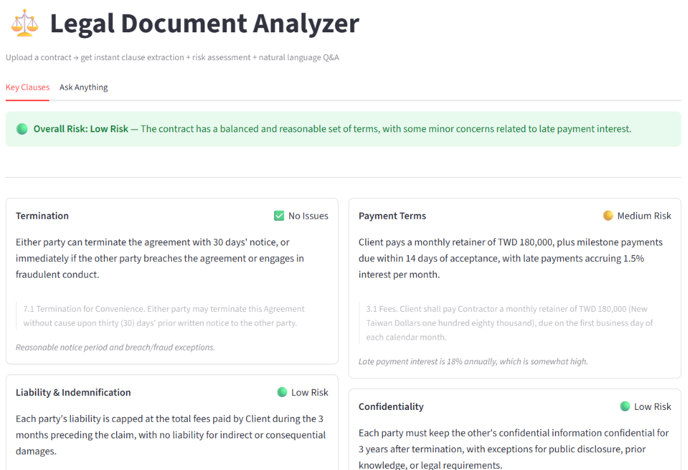

# ⚖️ Legal Document Analyzer

> Upload any contract PDF → auto-extract key clauses, assess legal risks, ask questions in plain language, and download a formatted report.

**[Live Demo](https://legal-doc-analyzer-jdmijowrqdsr8jvz4rak6c.streamlit.app)** &nbsp;|&nbsp; Built with Groq + Streamlit &nbsp;|&nbsp; No API key needed to try



---

## The problem

Most people sign contracts they don't fully understand.

Reading a 20-page service agreement takes an hour — and even then, non-lawyers miss critical clauses about liability caps, IP ownership, or aggressive late-payment penalties. The risk isn't just in what's written. It's in what's missing.

---

## Why not just use ChatGPT?

| | ChatGPT / Claude | Legal Doc Analyzer |
|---|---|---|
| Upload PDF directly | Requires paid plan | ✅ Free |
| Knows what to extract | You have to ask | ✅ Auto-extracts 7 clause types |
| Flags risks proactively | You have to ask | ✅ Auto-assesses risk per clause |
| Cites exact document text | Inconsistent | ✅ Every answer includes source quote |
| Works on documents of any length | Context limit issues | ✅ BM25 retrieval over full document |
| Exportable report | No | ✅ Download PDF analysis report |

The core difference: **this tool knows what legal clauses matter before you ask.** It doesn't need you to know the right questions. It scans the full document, surfaces what matters, and tells you what to watch out for.

---

## What it does

### 1. Key Clause Extraction
Automatically identifies and summarizes 7 critical clause types — including specific rates, amounts, and conditions:

- **Termination** — notice periods, conditions, and immediate termination triggers
- **Payment Terms** — fee structure, schedules, late payment interest rates
- **Liability & Indemnification** — damage caps and risk allocation
- **Confidentiality** — scope, duration, and exclusions
- **Governing Law** — jurisdiction and dispute resolution
- **IP Ownership** — who owns work created under the agreement
- **Contract Duration** — effective dates, renewal, and expiry

### 2. Risk Assessment
Each clause is automatically rated 🔴 High / 🟡 Medium / 🟢 Low based on specific criteria:
- Late payment interest above 12% annually → High Risk
- Missing liability cap → High Risk
- One-sided termination rights → High Risk
- Missing clause where one is expected → assessed by absence

### 3. Plain-Language Q&A
Ask anything about the document in natural language. Every answer cites the exact passage it came from.

### 4. Export PDF Report
Download a formatted analysis report with clause summaries, verbatim quotes, and color-coded risk indicators.

---

## How to use it

1. Open the **[live demo](https://legal-doc-analyzer-jdmijowrqdsr8jvz4rak6c.streamlit.app)**
2. Upload any PDF contract in the sidebar (try the included `sample_contract.pdf`)
3. Click **Analyze document**
4. **Key Clauses** tab → click **Extract key clauses** to get risk-assessed clause breakdown
5. **Ask Anything** tab → ask questions in plain language
6. Click **Download Analysis Report** for the PDF export

No setup, no account, no API key needed.

---

## Sample questions to try

```
What are the grounds for immediate termination?
Who owns the IP created during this engagement?
What happens if a payment is late?
Is there a liability cap, and what is it?
Can the client share deliverables with third parties?
```

---

## How it works

### Q&A pipeline
```
PDF → pdfplumber (text extraction)
    → chunk_text (300-word overlapping chunks)
    → BM25Okapi index (keyword retrieval, no vector DB)
    → user question → BM25 retrieves top 2 relevant chunks
    → Groq LLM answers from chunks only (cannot fabricate)
```

### Clause extraction pipeline
```
PDF → BM25 index (same as above)
    → for each of 7 clause types:
        → targeted keyword query against BM25 index
        → retrieve most relevant chunks (works on any document length)
    → single Groq API call with all retrieved chunks
    → structured JSON output (forced via response_format)
    → risk assessment on extracted summaries
    → PDF report generation (fpdf2)
```

**Why BM25 over embeddings?** No paid embedding API, no vector database, no latency. BM25 keyword retrieval is fast, free, and sufficient for legal contracts where terms are precise and consistent.

**Why RAG over full-document prompting?** LLMs have token limits and hallucinate when given too much irrelevant context. RAG ensures the model only sees relevant excerpts — keeping answers accurate and responses fast.

---

## Tech stack

| Component | Tool |
|---|---|
| LLM | Groq API — `llama-3.1-8b-instant` (free tier) |
| Retrieval | BM25 via `rank-bm25` (no vector DB) |
| PDF parsing | `pdfplumber` |
| PDF generation | `fpdf2` |
| UI | Streamlit |
| Structured output | JSON mode via Groq `response_format` |

---

## Local setup

```bash
git clone https://github.com/chaser940428-pixel/legal-doc-analyzer
cd legal-doc-analyzer
pip install -r requirements.txt
```

Create a `.env` file:
```
GROQ_API_KEY=your_key_here
```

Get a free key at [console.groq.com](https://console.groq.com) — no credit card required.

```bash
streamlit run app.py
```

---

## Project structure

```
legal-doc-analyzer/
├── app.py              # Streamlit UI — upload, tabs, Q&A, download
├── analyzer.py         # RAG pipeline — chunk, BM25 index, retrieve, answer
├── extractor.py        # Clause extraction — BM25 retrieval + structured JSON output
├── risk.py             # Risk assessment — rates each clause high/medium/low/none
├── report.py           # PDF report generation with color-coded risk indicators
├── sample_contract.pdf # Sample software development services agreement for testing
├── requirements.txt
└── .env.example
```

---

## Extending

To add a new clause type, add one entry to `CLAUSE_LABELS` and `CLAUSE_KEYWORDS` in `extractor.py`:

```python
# In CLAUSE_LABELS:
"dispute_resolution": "Dispute Resolution",

# In CLAUSE_KEYWORDS:
"dispute_resolution": [
    "dispute resolution arbitration mediation litigation",
],
```

No other changes needed. The extraction, risk assessment, and PDF report all pick it up automatically.
